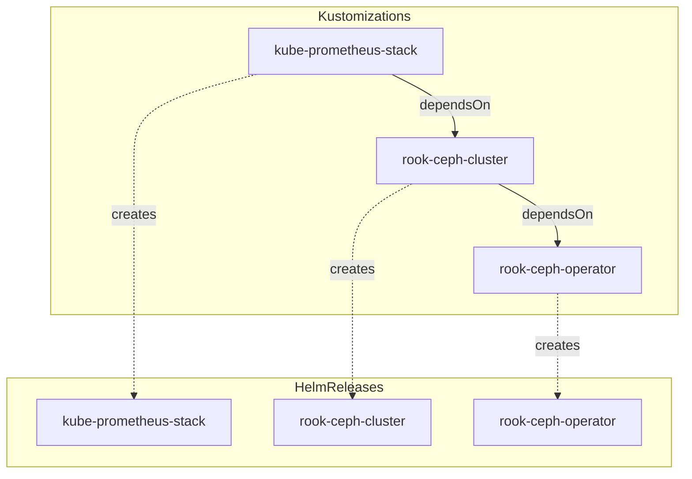

<div align="center">

## 📊 Cluster Status

</div>


<div align="center">

[](https://discord.gg/home-operations)&nbsp;&nbsp;
[](https://talos.dev)&nbsp;&nbsp;
[](https://kubernetes.io)&nbsp;&nbsp;
[](https://fluxcd.io)&nbsp;&nbsp;
</div>

<div align="center">

[](https://github.com/kashalls/kromgo)&nbsp;&nbsp;
[](https://github.com/kashalls/kromgo)&nbsp;&nbsp;
[](https://github.com/kashalls/kromgo)&nbsp;&nbsp;
[](https://github.com/kashalls/kromgo)&nbsp;&nbsp;
[](https://github.com/kashalls/kromgo)&nbsp;&nbsp;
[](https://github.com/kashalls/kromgo)&nbsp;&nbsp;
[](https://github.com/kashalls/kromgo)
</div>


## Cluster Structure

```sh 
📁 kubernetes/       # Kubernetes cluster defined as code
├── 📁 apps          # Apps deployed into my cluster grouped by namespace
├── 📁 components    # Re-usable kustomize components
└── 📁 flux          # Flux system config
```

# Flux Kustomization Dependencies

The dependency structure of the core Flux Kustomizations in this cluster, specifically focusing on the storage (Rook-Ceph) and observability (Prometheus) stack.

## Dependency Graph

The following diagram illustrates how the Kustomizations are ordered and the HelmReleases they manage.



## Description

1.  **rook-ceph-operator**: The base Kustomization that installs the Rook-Ceph operator.
2.  **rook-ceph-cluster**: Depends on the operator being ready. It configures the actual Ceph cluster, pools, and storage classes.
3.  **kube-prometheus-stack**: Depends on the storage cluster being ready, as it uses Ceph block storage (RBD) for persistent data (Prometheus and Alertmanager metrics/state).

Each Kustomization points to a directory containing a `HelmRelease` resource, which Flux's Helm Controller then reconciles to install the respective applications.


## Special Thanks
Thanks to the [home-operations](https://discord.gg/home-operations) community for providing tons of insight and huge shoutout to the [@onedr0p](https://github.com/onedr0p) for his awesome cluster template a great starting point anyone wishing to run some k8s at home. 
